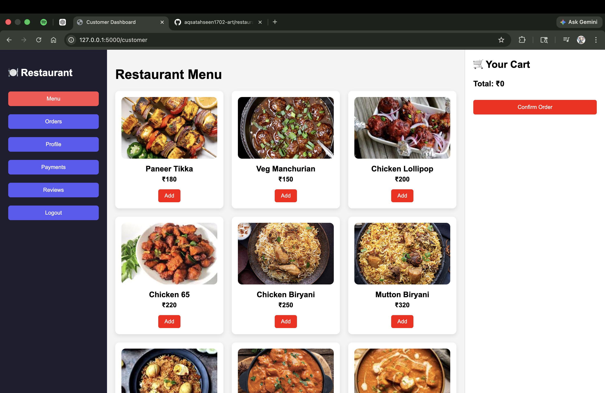
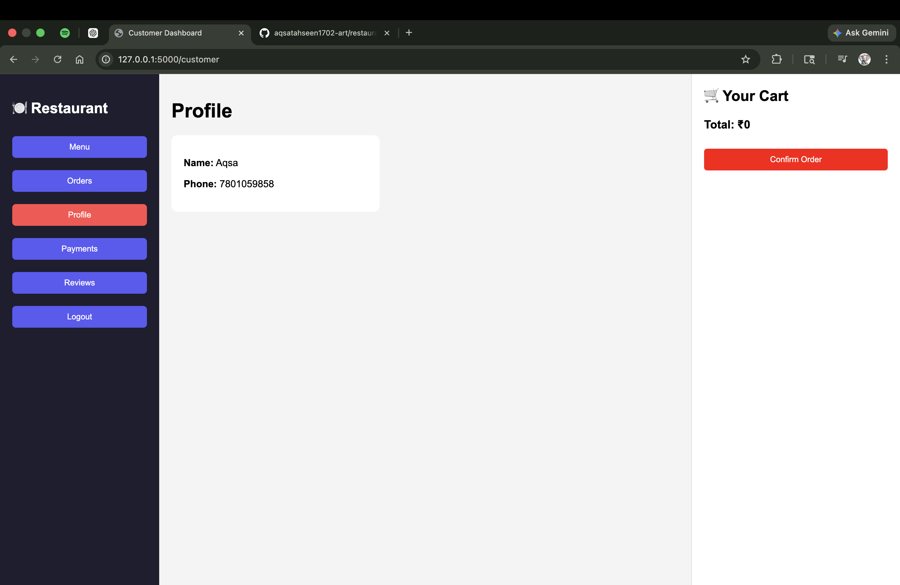
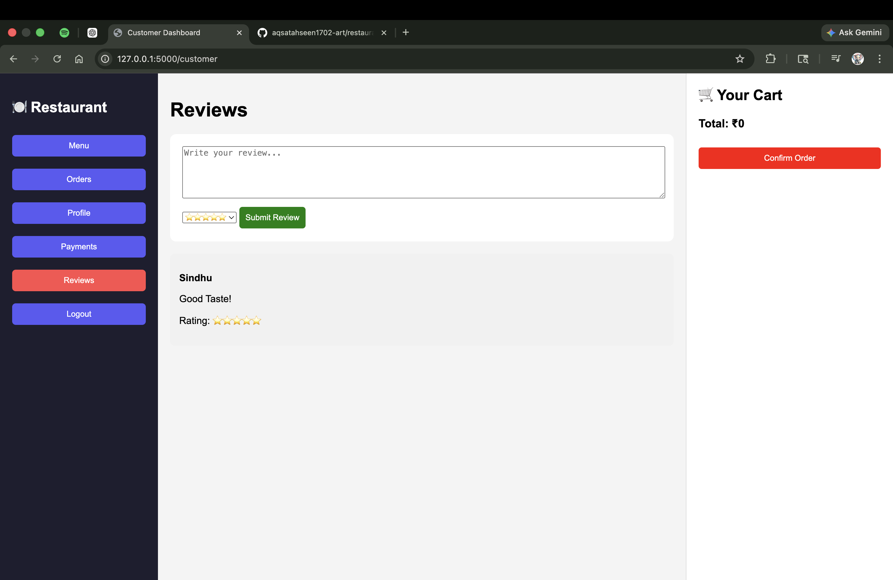
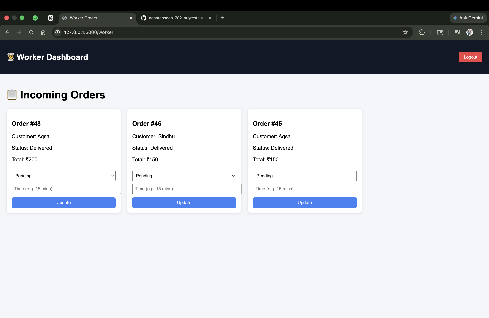

## 🍽️ Restaurant Management System

A full-stack Restaurant Management System designed to streamline food ordering, customer interaction, and staff workflow. This system allows customers to place orders, track them in real time, and provide feedback, while workers manage and update order statuses efficiently.

## 🚀 Features

👤 Customer Side
	•	User login using name & phone number
	•	Browse menu with images and prices
	•	Place orders (Takeaway / Dine-in)
	•	View order history
	•	Real-time order status updates
	•	Make payments
	•	Submit reviews and ratings

👨‍🍳 Worker Side
	•	Worker login dashboard
	•	View incoming orders
	•	Update order status
	•	Provide time estimates for delivery
	•	Manage workflow efficiently

⸻

## 🛠️ Tech Stack
	•	Frontend: HTML, CSS, JavaScript
	•	Backend: Python (Flask)
	•	Database: MySQL
	•	Tools: Git, GitHub

⸻

## 🗄️ Database Schema

The system uses the following tables:
	•	customers – stores customer details
	•	menu – contains food items
	•	orders – stores order details
	•	order_items – maps items to orders
	•	reviews – stores customer feedback
	•	workers – manages staff data

⸻

## 📸 Screenshots

### 🔐 Login Page

### 📊 Dashboard

### 💳 Payments

### 👤 Profile

### ⭐ Reviews

### 👨‍🍳 Worker Dashboard

### 🔑 Worker Login Page

⸻

## ⚙️ Installation & Setup

1️⃣ Clone the Repository

git clone https://github.com/aqsatahseen1702-art/restaurant-management-system.git
cd restaurant-management-system

2️⃣ Setup Virtual Environment

python -m venv venv
source venv/bin/activate   # Mac/Linux
venv\Scripts\activate      # Windows

3️⃣ Install Dependencies

pip install -r requirements.txt

4️⃣ Setup Database
	•	Open MySQL
	•	Run the provided SQL file:

SOURCE restaurant_management.sql;

5️⃣ Run the Application

python app.py

⸻

## 📌 Future Improvements
	•	Online payment integration
	•	Admin panel for full control
	•	Table reservation system
	•	Mobile app version
	•	AI-based food recommendations

⸻

## 🤝 Contributors
	•	Aqsa Tahseen

⸻

## 📄 License

This project is for educational purposes.
